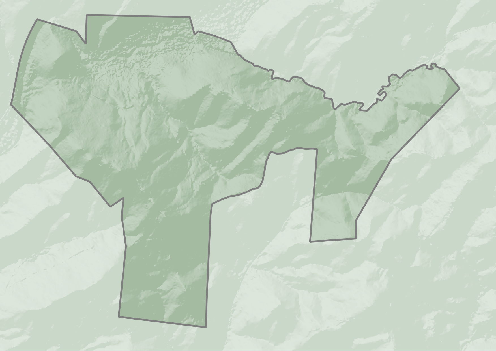

+++
date = '2026-01-31T12:01:43-05:00'
draft = false
title = 'Cheek Creek at Lovin Hill'
+++

Welcome to Cheek Creek at Lovin Hill, a 220 acre ecological restoration project in the southeast corner of Montgomery County, NC, in the Uwharrie National Forest. It is the ancestral home of the Skaruhreh, Cheraw, Catawba, and Lumbee tribes. The property has rolling hills with several ephemeral streams, and a long section of Cheek Creek, a year-round creek that drains into the Pee Dee watershed. 

In the early 21st century most of it was clearcut and planted with loblolly pine as a timber farm. Our plan involves thinning and clearing the pine and reintroducing fire to the landscape in order to re-establish a biologically diverse understory. We are also removing invasive species like Privet (Lingustrum sinense), tree of heaven (Ailanthus altissima), stiltgrass (Microstegium vimineum), and Japanese honeysuckle (Lonicera japonica).

We are excited to see what kind of plants will come up after we thin and burn as part of our management plan. Already we’ve found rare wildflower species like Blue False Indigo (Baptisia australis) and Purple Milkweed (Asclepias purpurascens). We’re excited to share what other cool plants begin to show up!

If you're curious to see more flora and fauna from our site, please [see our iNaturalist project](https://www.inaturalist.org/projects/cheek-creek-species-list).

-----



